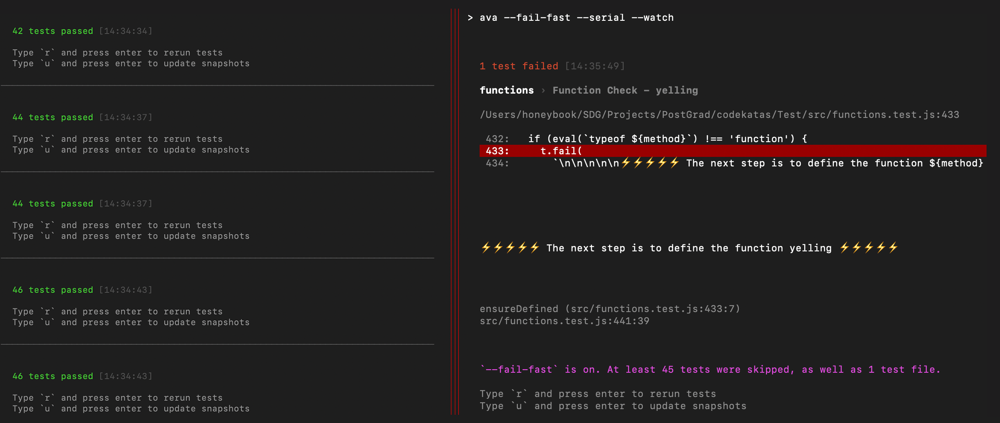

# Codekatas

This is a list of Code Katas (code logic challenges). This list was compiled during my development bootcamp from daily morning challenges on code wars and occasional homework assignments. I modified the test samples to work in the Ava test runner in JavaScript. I have also created extra tests on my own to develop my skills and learn more about the testing process under the hood. 
